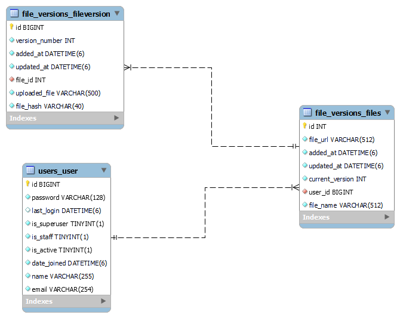

# Propylon Document Manager Assessment

The Propylon Document Management Technical Assessment is a simple (and incomplete) web application consisting of a basic API backend and a React based client. This API/client can be used as a bootstrap to implement the specific features requested in the assessment description.

## Getting Started

1. Install [Docker](https://www.docker.com/products/docker-desktop/)
2. `$ make build`. This will spin up docker image for the Backend Server
3. `$ make migrate` to create the database.
4. `$ make load_file_fixtures` to create the fixture file versions.
5. `$ make start` to start the development server on port 8001.
6. Navigate to the client/document-manager.
7. `$ npm install` to install the dependencies.
8. `$ ng s` to start the Angular development server.

## Settings

Moved to [settings](http://cookiecutter-django.readthedocs.io/en/latest/settings.html).

## Basic Commands

### Setting Up Your Users

- To create a **superuser account**, use this command:

      $ python manage.py createsuperuser

### Type checks

Running type checks with mypy:

    $ make mypy

### Test coverage

#### Running tests with pytest

    $ make test

## Make Commands

#### Start Backend

    $ make start

#### Run Tests with Coverage Report

    $ make test

## Schema For files

- A user Can have multiple files
- A File can have any number of versions
- Content of file version needs to be unique for each file object
- Each file should have atleast file Version attached to it
